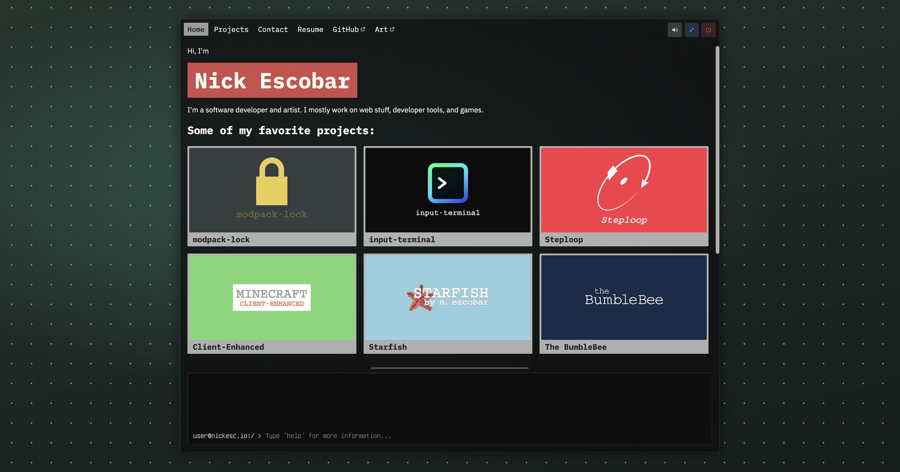

# [nickesc.io](https://nickesc.io)

My personal developer portfolio. It collects my projects, links to the places where I release my work, and provides a way to contact me.

## Overview

The site is a static SvelteKit app with a terminal-inspired interface. GitHub Actions builds the site from the `main` branch and deploys it to GitHub Pages.

## Features

- An interactive command prompt
- A filterable project archive
- A resume with downloadable PDF
- Links to my profiles and published work
- A contact form
- Switchable backgrounds
- Interface sounds

## Tech stack

- Svelte 5 and SvelteKit
- TypeScript
- Vite
- mdsvex
- SvelteKit's static adapter
- GitHub Actions and GitHub Pages
